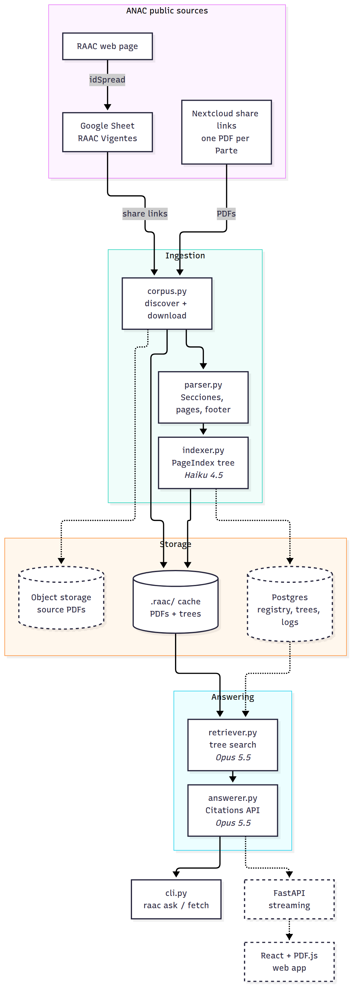
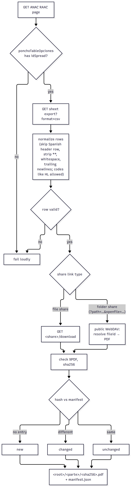
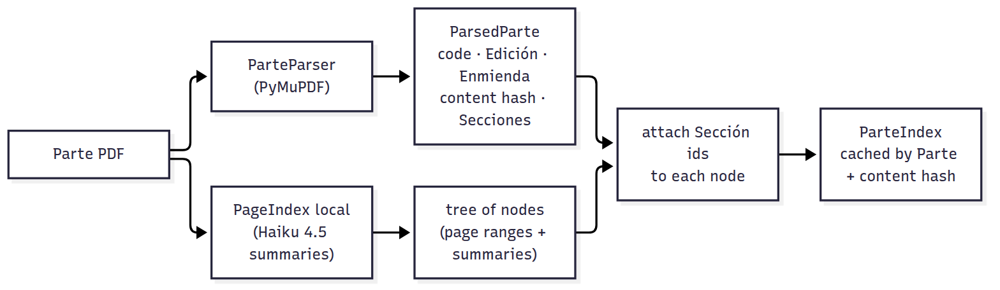
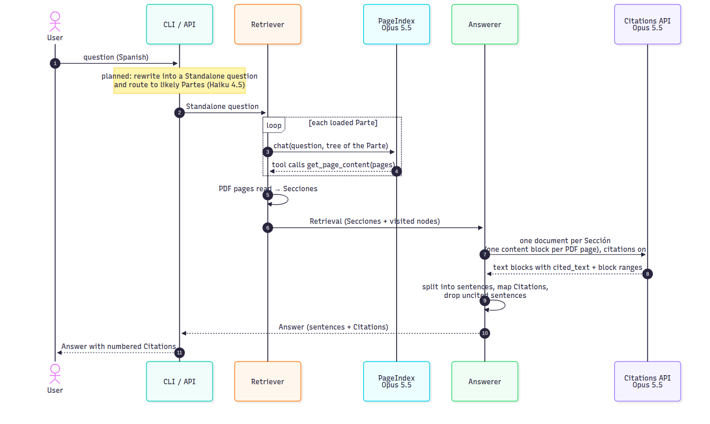
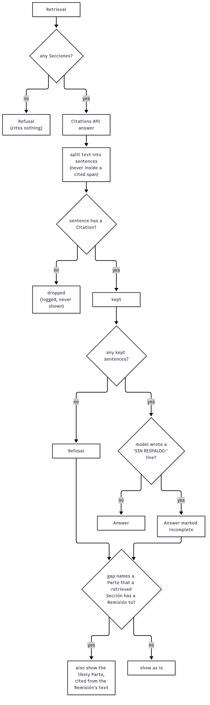
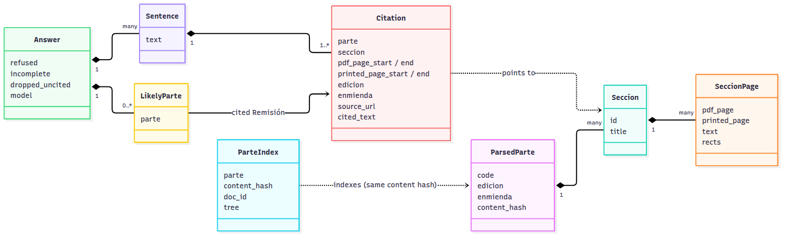
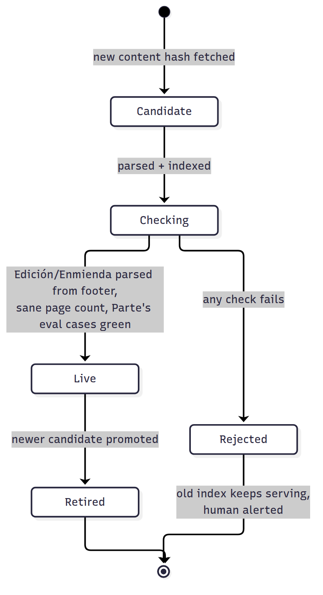

# raac-rag

Ask a free-text question about the Argentine civil aviation regulations (RAAC) and get an Answer in which every sentence cites the Parte, Sección, PDF page and Edición it comes from, with a link to the official ANAC PDF.

Not an official source. It does not replace AIP, NOTAMs or ANAC.

- Domain terms (Parte, Sección, Remisión, Edición, Enmienda, ...): [`CONTEXT.md`](CONTEXT.md)
- Architecture decisions: [`docs/adr/`](docs/adr/)
- Contributor and agent rules: [`AGENTS.md`](AGENTS.md)
- Commands (install, test, run): [`pyproject.toml`](pyproject.toml)

## Status

Today the pipeline runs end to end from the command line (`raac fetch`, `raac ask`) over Parte 61, caching PDFs and PageIndex trees under `.raac/`. The web API, object storage, frontend, Postgres registry and automatic promotion of new Enmiendas are planned. The diagrams below mark planned pieces with dashed borders. Their Mermaid sources are in [`docs/diagrams/`](docs/diagrams/); after editing one, re-render the images with `docs/diagrams/render.sh`.

## High-level architecture

Retrieval uses PageIndex in local mode (an LLM reads a tree of each Parte, no vector store, [ADR 0001](docs/adr/0001-pageindex-local-for-retrieval.md)). Answers are written with the Claude Citations API so every Citation is data returned by the API, never text parsed out of the model's prose ([ADR 0002](docs/adr/0002-answers-via-claude-citations.md)). Models per stage (in italics above) are set in [`src/raac/models.toml`](src/raac/models.toml).

## Corpus discovery and download

`raac fetch` finds every Parte in the RAAC vigente and downloads its PDF. Nothing about the sheet is hardcoded: its ID is read from the ANAC page on every run.

The share link is the stable citation URL. It carries no version, so a new Enmienda shows up only as a new content hash.

## Indexing a Parte

The parser reads the Parte code from the page header and the Edición, Enmienda and printed page label from each page footer. It keeps the physical PDF page (for `#page=N` links) and the printed page label apart: in Parte 61, Sección 61.535 is on PDF page 67 but printed page 10.

## Answering a question

Each retrieved Sección is sent as its own document whose content blocks are its PDF pages, so a citation's block range maps straight back to a Sección and its PDF pages.

## Grounded or silent

Every sentence shown carries a Citation. This is how the Answerer decides what to show:

## Domain model

## Index lifecycle (planned)

Re-ingesting a Parte replaces its index instead of adding to it. A changed PDF is indexed beside the live one and only promoted when automated checks pass.

The API keeps live trees in memory and reloads them on promotion. Every exchange is logged (question, routed Partes, visited nodes, Secciones, Answer with Citations, latency, tokens, cost, model IDs, index version) under a random conversation ID, so it can be replayed.
